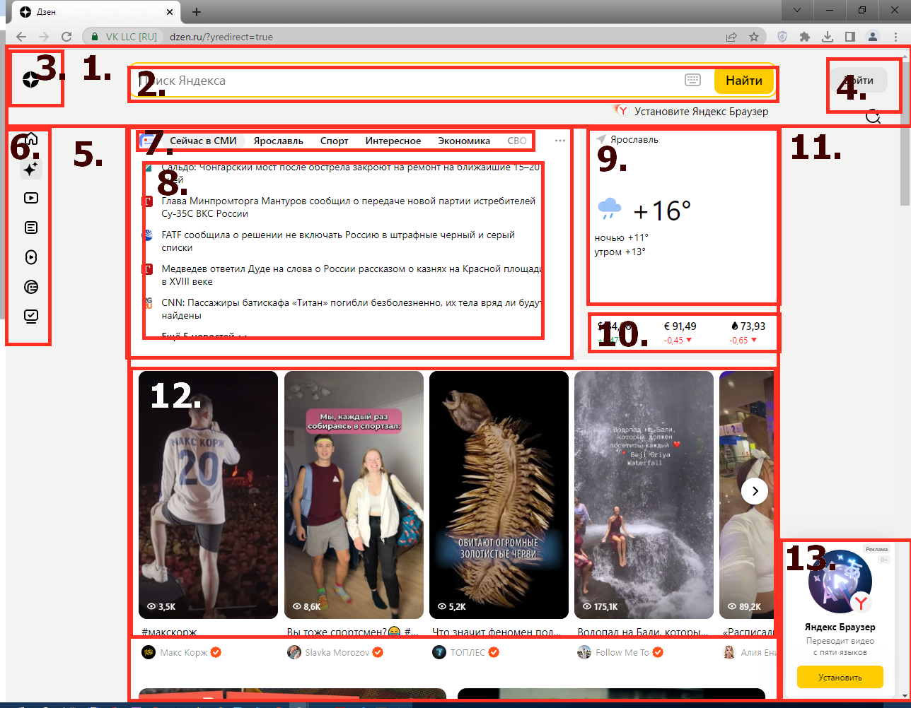
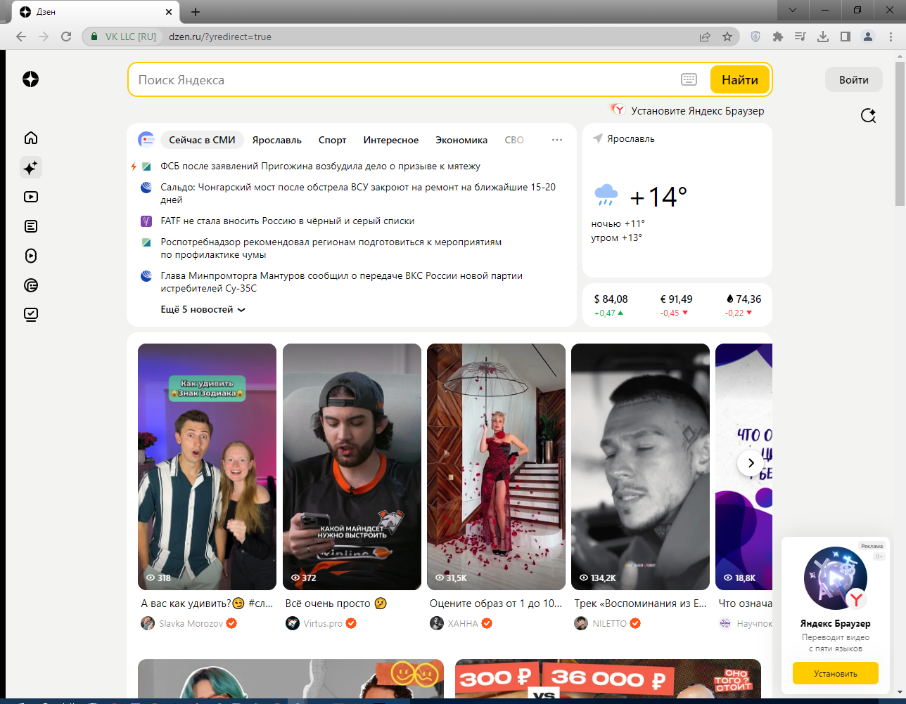
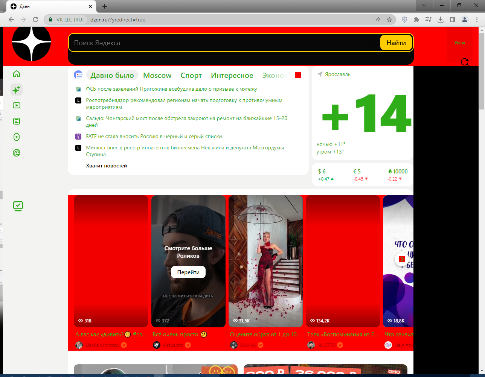
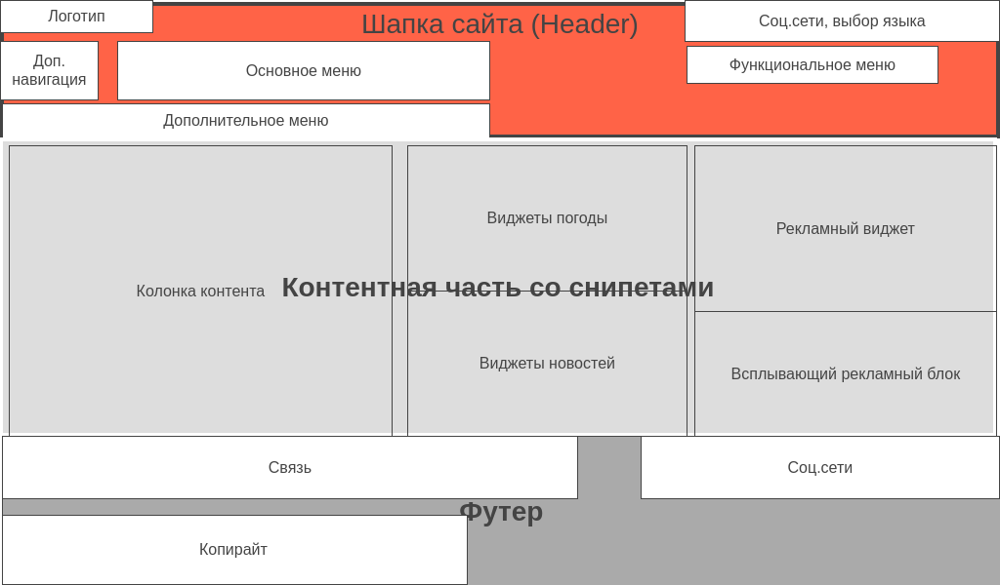

#  Веб-технологии: вчера, сегодня, завтра

## Задача: на основе сайта <https://yandex.ru>:

### 1. Сайт работает на протоколе _https_.

### 2. Структура страницы сайта:

1. Header (Шапка сайта);
2. Поисковая строка;
3. Логотип;
4. Блок авторизации;
5. Контентная часть сайта;
6. Дополнительное меню;
7. Популярные "хэштеги";
8. Популярные новости;
9. Виджет погоды;
10. Виджет курсов валют;
11. Новостной виджет;
12. Колонка контента (бесконечная);
13. Всплывающий рекламный блок.

### 3. Внесение изменений на страницу с помощью инструмента разработчика

* Заменён цвет заднего фона страницы на красный;
* Заменен фон на чёрный в поле ввода поискового запроса и увеличена его ширина;
* Поменян цвет шрифта на всей странице на зелёный;
* Заменены надписи на кнопках: **"Войти"/"Уйти"**, **"Сейчас в СМИ"/"Давно было"**, **"Ярославль"/"Moscow"**, **"Ещё 5 новостей"/"Хватит новостей"**;
* Убрана иконка с облаком в виджете погоды;
* Увеличен шрифт с температурой в виджете погоды;
* Возвращены значения курсов валют и нефти к докризисным уровням в виджете котировок;
* Удалены первый и четвертый ролики в блоке видеосервиса;
* Значительно увеличен Логотип Дзена;
* Кнопка с лого Яндекса отправляет на сайт гугла;
* Увеличен отступ и размер иконки "Подписки".

### 4. Прототип низкой детализации сайта:
 <https://wireframe.cc/X98fVF>